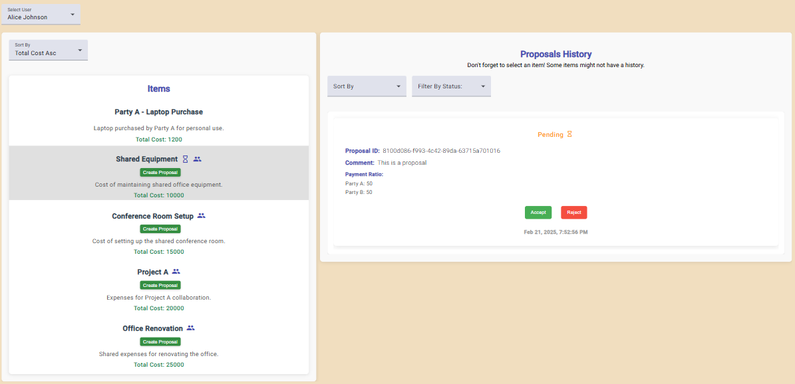

# Description

This Angular-based application is designed to help users manage items within their party or company. Each item can be linked to a single party or shared among multiple parties, with users always associated with one specific party or company.

This README covers topics such as Key Features, LocalStorage, Responsive Design for Small Screens, Layout Considerations, Icons Explanations, Proposal Lifecycle, Filtering and Sorting Proposals, Accessibility Considerations - Arial Hidden, Future Work and UI Pictures.

## Technologies Used

- Angular
- NgRx
- RxJS
- TypeScript
- Angular Material

## Set up

- npm install -g @angular/cli

Open your package.json file and ensure that the scripts section includes the following entries:
"scripts": {
"ng": "ng",
"start": "ng serve",
"build": "ng build",
"watch": "ng build --watch --configuration development",
"test": "ng test"
}

- ng serve to start the application

## User Selector

Users can easily switch between different users within the application. When a user is selected from the dropdown, the associated items, proposals, and all relevant data are dynamically updated and displayed.

## NgRx Implementation

This project utilizes NgRx for state management, which provides a structured way to manage application state.
NgRx for state management, provides a scalable and maintainable architecture.

There are actions, reducers, effects, selectors form item, owner, proposal and user.

### Actions

Actions: Defined using createAction, actions are dispatched to notify the application about state changes.
Actions are defined to manage item-related events. Some of the key actions include:

- loadItems: Initiates loading items.
- loadItemsSuccess: Dispatched when items are successfully loaded.
- loadItemsFailure: Dispatched when there is an error loading items.
- loadItemsByUser: Initiates loading items for a specific user.
- selectItem: Sets the currently selected item.

### Reducers

Reducers: Defined using createReducer, reducers handle state transitions based on the dispatched actions
Reducers are used to specify how the state changes in response to actions. The itemReducer manages the state of items and the selected item.

### Selectors

Selectors: Defined using createSelector, selectors are used to retrieve specific slices of the state, enabling efficient state access.
Selectors are used to obtain slices of the state. The selectAllItems selector fetches all items from the state.

### Effects

Effects: Implemented using createEffect, effects handle side effects in response to actions. They interact with services to fetch or manipulate data.
Effects handle side effects such as API calls. The ItemEffects class manages the loading of items and handling success or failure.

## LocalStorage

### JSON files

The loadInitialData method is designed to prefill the application’s local storage with necessary data using provided JSON files

### Persistence of Proposals

In addition to the initial data loading, it's important to note that the proposals created and modified within the application are also stored in local storage.

## Layout Considerations

Currently, when the screen size changes, the layout adapts, and components may shift positions based on the screen size. However, there is still room for improvement in terms of accessibility and styling to ensure that all screen size scenarios are effectively covered.

## Responsive Design for Small Screens

On screens smaller than 1024 pixels, the component allows users to view and select items by pressing the Items List button located in the top-left corner of the screen.

### Select Items button & Items Container

#### Initial State:

The Proposals History is displayed on the screen along with the Select User dropdown and the Items List button.

#### Displaying Items:

When the Items List button is pressed, the Proposals History disappears, and the Items Container is displayed.

#### Closing the Items Container:

The Items Container can be closed in two ways:

- By selecting an item from the Items Container.
- By toggling the Items List button again.

#### Returning to Proposals History:

After closing the Items Container, the Proposals History is displayed again, showing the appropriate data.

### Proposals History

#### Initial State:

The Proposals History is displayed on the screen along with the Select User dropdown and the Items List button.

#### Displaying Items:

When the Items List button is pressed, the Proposals History disappears, and the Items Container is displayed.

#### Closing the Items Container:

The Items Container can be closed in two ways:

- By selecting an item from the Items Container.
- By toggling the Items List button again.

#### Returning to Proposals History:

After closing the Items Container, the Proposals History is displayed again, showing the appropriate data.

## Visual Effects

### Hover Effects:

When users hover over the proposals and items in the lists, visual effects are applied (such as shadows), giving the impression that the items are coming out of the background. This enhances the user experience and provides a more interactive feel.

## Icons

-Icon: local_offer
Meaning: Represents the action of making a proposal. When clicked, it triggers the openProposalDialog(item) method, which opens a dialog box containing the form necessary for creating a new proposal.

- Icon: group
  Meaning: Indicates that the item is shared with other users.

- Icon: hourglass_empty
  Meaning: Indicates that the proposal is still pending.

- Icon: check_circle
  Meaning: Represents that the proposal has been accepted or finalised.

- Icon: cancel
  Meaning: Indicates that the proposal has been rejected.

- Icon: remove_circle
  Meaning: Represents that the proposal has been withdrawn.

- Icon: hourglass_empty
  Meaning: This icon appears if there are pending proposals associated with the current item.

## Proposal Lifecycle

### Creating a Proposal:

When a user makes a proposal, it is submitted for review by all owners from the involved parties. This proposal must be accepted by all relevant stakeholders to move forward.

### Withdrawal of Proposal:

If the proposal has not been accepted by all parties, the user has the option to withdraw the proposal.
Impact of Withdrawal: Once a proposal is withdrawn, it can no longer be accepted or rejected by any party. This action effectively nullifies the proposal, removing it from the active decision-making process.

### Counterproposals:

If a user decides to make a counterproposal to an existing proposal, they are effectively suggesting modifications to the original proposal.
When a counterproposal is made, the original proposal is put on hold and its status changes, usually to reflect that it is awaiting responses regarding the counterproposal.

### Withdrawing a Counterproposal:

If the user withdraws their counterproposal, the original proposal is reactivated.
Reactivation of Original Proposal: Once reactivated, the original proposal returns to the Pending status. This means that it is again subject to acceptance or rejection by all parties involved. Stakeholders can now either accept the original proposal or choose to counter it again.

### Finalisation of Proposal:

A proposal is marked as Finalised when all owners from all parties accept it. This state indicates that the proposal has been fully agreed upon and is now in effect.
Significance of Finalisation: Finalisation ensures that all parties are on the same page, and the terms of the proposal are officially accepted, preventing any further modifications or discussions unless a new proposal is initiated.

#### Summary

Pending: The proposal is awaiting responses from all parties. It can be accepted or rejected.
Withdrawn: The proposal is no longer active, and no actions can be taken on it. This applies to both the original proposal and any counterproposals.
Finalised: All parties have accepted the proposal, and it is now officially in effect.

## Filtering and Sorting Proposals

The application provides a user-friendly interface to filter and sort proposals using Angular Material components. Users can filter proposals based on their status (e.g., Pending, Accepted) and sort them by different criteria, such as date.

Using the filter, users can filter the proposals from their history based on the selected status, allowing them to quickly identify items that require attention or action.
By using the dateAsc and dateDsc options, users can filter proposals based on the date they were created.
The filering and sorting can be applied simultaneously.

## Accessibility Considerations

#### Arial Hidden

The openProposalDialog method is responsible for opening a dialog box where users can create a proposal for a specific item. It utilizes Angular Material's dialog component to display the ProposalDialogComponent.

The openProposalDialog method saves the currently focused element before opening the dialog.
It configures the dialog with a minimum width of 400 pixels and passes the item data along with a title for the dialog.
When the dialog is closed, it restores focus to the element that was focused before the dialog was opened, ensuring a better user experience, particularly for users relying on assistive technologies.

#### Accessibility Considerations

When the dialog is opened, aria-hidden="true" is added to the app-root element to prevent background content from being accessible to assistive technologies. This improves accessibility by focusing user attention on the dialog content.

### Future Work

- Currently, when a user selects a value from any sort or filter, the selection remains the same (and the new items will be sorted accordingly) even when the user changes. As future work, it is recommended that these fields refresh when a new user is selected. This improvement will enhance the user experience by ensuring that filters and sorts are contextually relevant to the current user's data.
- Work more on responsiveness and UI.
- It could be beneficial for both the Items Container and History Container to have fixed sizes on large screens, with a scrolling functionality to enhance user experience.
- There is ongoing work to improve accessibility within the Proposal Dialog, including adjustments to text sizes and other UI elements.
- State management improvements.
- Further enhancements in UI design are necessary to ensure a more inclusive experience for all users.

### UI Pictures





# ItemManager

This project was generated using [Angular CLI](https://github.com/angular/angular-cli) version 19.1.7.

## Development server

To start a local development server, run:

```bash
ng serve
```

Once the server is running, open your browser and navigate to `http://localhost:4200/`. The application will automatically reload whenever you modify any of the source files.

## Code scaffolding

Angular CLI includes powerful code scaffolding tools. To generate a new component, run:

```bash
ng generate component component-name
```

For a complete list of available schematics (such as `components`, `directives`, or `pipes`), run:

```bash
ng generate --help
```

## Building

To build the project run:

```bash
ng build
```

This will compile your project and store the build artifacts in the `dist/` directory. By default, the production build optimizes your application for performance and speed.

## Running unit tests

To execute unit tests with the [Karma](https://karma-runner.github.io) test runner, use the following command:

```bash
ng test
```

## Running end-to-end tests

For end-to-end (e2e) testing, run:

```bash
ng e2e
```

Angular CLI does not come with an end-to-end testing framework by default. You can choose one that suits your needs.

## Additional Resources

For more information on using the Angular CLI, including detailed command references, visit the [Angular CLI Overview and Command Reference](https://angular.dev/tools/cli) page.
